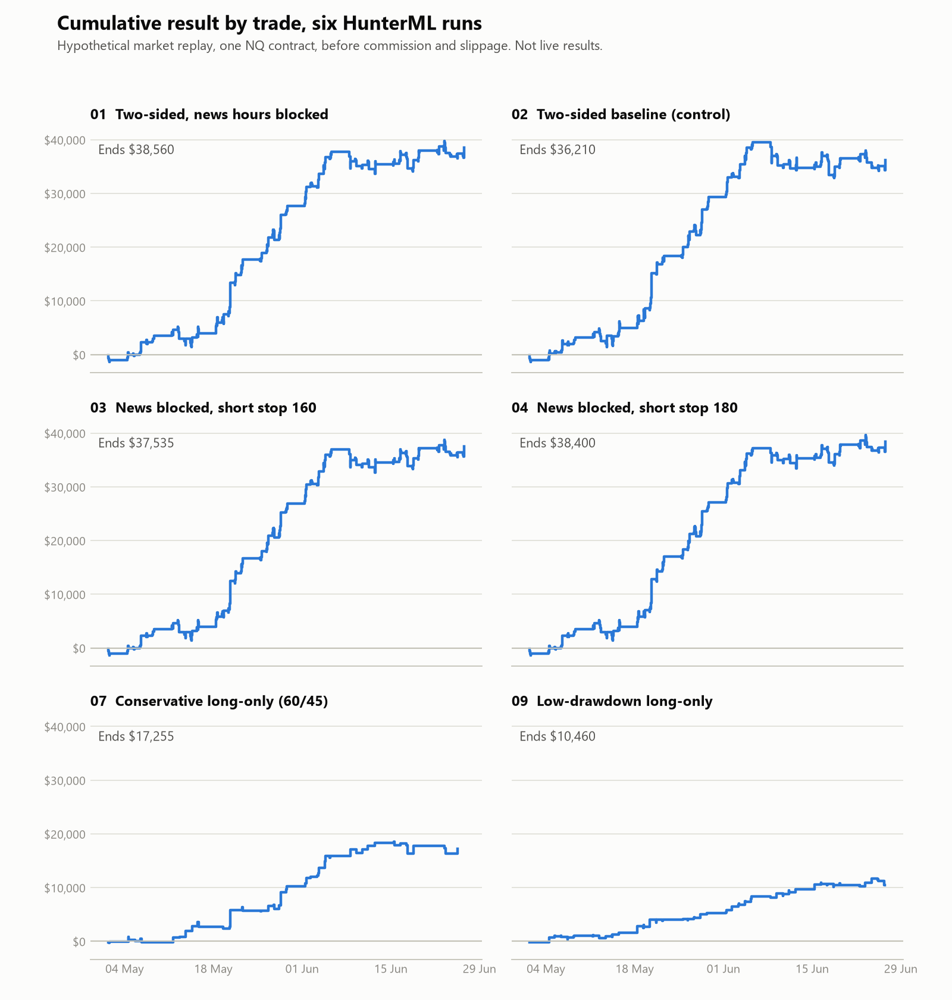
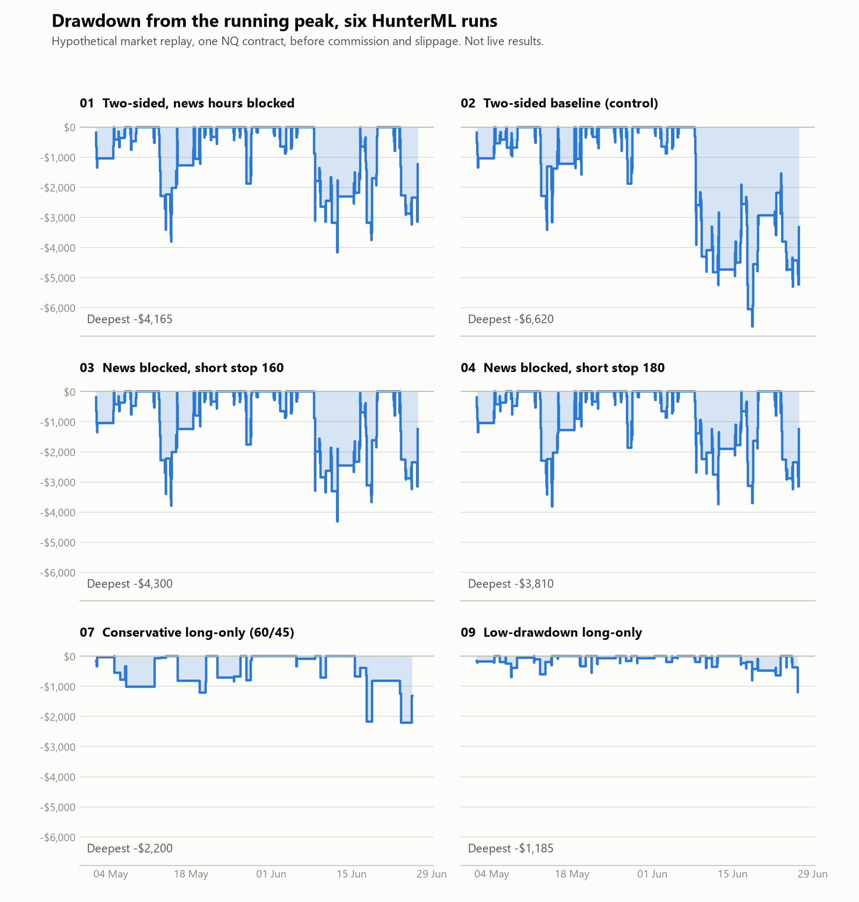
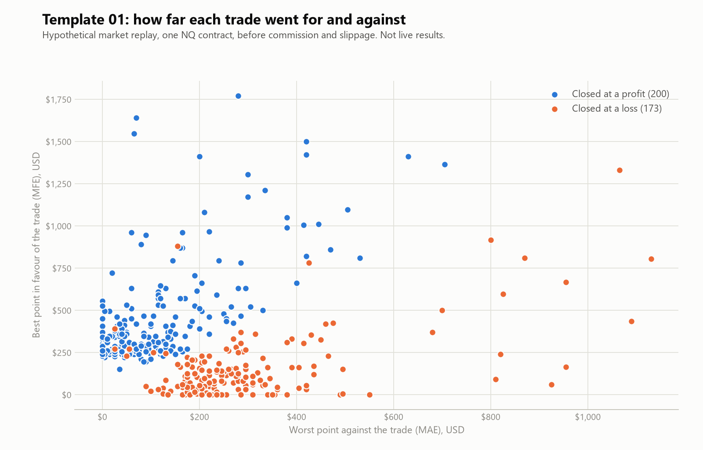

# Analysis of the published HunterML files

**Hypothetical market replay results.** One NQ contract, before commission and slippage, 1 May to 26 June 2026. None of this is a live trading record. Read the [limits in the main README](../README.md#read-this-before-using-the-numbers) first.

Everything on this page is produced by [`analyze.py`](analyze.py) from the CSV files in [`hunterml/excursions/`](../hunterml/excursions). It covers the six distinct runs. Templates 05, 06, 08 and 10 are reruns of 02, 07 and 09, so they are left out.

## Summary

| Run | Configuration | Trades | Win rate | Net | Profit factor | Max drawdown |
| --- | --- | --- | --- | --- | --- | --- |
| 01 | Two-sided, news hours blocked | 373 | 53.62% | $38,560 | 1.75 | -$4,165 |
| 02 | Two-sided baseline (control) | 436 | 52.98% | $36,210 | 1.57 | -$6,620 |
| 03 | News blocked, short stop 160 | 374 | 53.48% | $37,535 | 1.74 | -$4,300 |
| 04 | News blocked, short stop 180 | 373 | 53.62% | $38,400 | 1.76 | -$3,810 |
| 07 | Conservative long-only (60/45) | 63 | 68.25% | $17,255 | 2.81 | -$2,200 |
| 09 | Low-drawdown long-only | 121 | 61.98% | $10,460 | 2.15 | -$1,185 |

Drawdown is measured on closed trades, from the running peak of cumulative result, starting at zero.

## Cumulative result



## Drawdown



## Excursions, template 01

Each dot is one trade. Further right means the trade went further against the position before it closed. Higher means it went further in favour.



## Run it with trading costs

The published files carry no commission and no slippage. To see the same tables and charts with a cost taken off every trade:

```
python analysis/analyze.py --cost 10
```

That rewrites this page and the three images using the cost you give it. Use your own broker's round-turn figure.

## Disclosure

Hypothetical performance results have many inherent limitations. No representation is being made that any account will or is likely to achieve profits or losses similar to those shown. The full disclosure is in the [main README](../README.md#disclosures). Futures trading involves substantial risk of loss and is not suitable for every investor.
